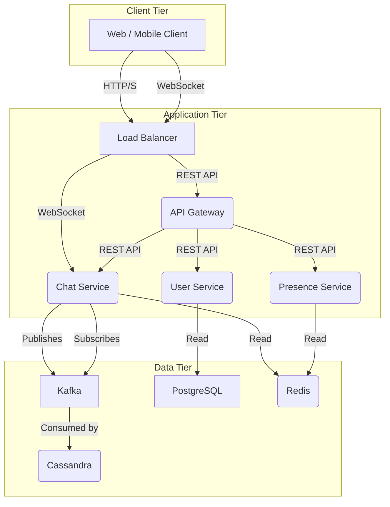

# Real-time Chat System

## 1. Requirements Analysis

### Scenario definition
Design a real-time chat system that allows users to send and receive messages in real-time.
This system should be able to handle high concurrency, low latency, and reliable delivery at scale, while ensuring a good user experience.

### Functional requirements
- Real-time message delivery
- Offline message delivery + push notification
- Message ordering within a conversation
- Read/unread tracking
- Message persistence

### Non-functional requirements
- High availability: > 99.95% uptime (22 mins per month)
- High concurrencyL support 1M+ simultaneous users
- Low latency: < 100ms per message
- Security: encryption
- Observability: monitoring latency, error rates, message loss

## 2. High-level Design

### Key Challenges

#### Handling Millions of Bi-directional Real-time Connections

The main challenge is managing the massive number of persistent, two-way connections needed for a live chat service. A single server can't handle this scale, and messages must be accurately routed between connected users.

To solve this, the system uses a **Load Balancer** to distribute connections to multiple scalable **Chat Services**. A **Pub/Sub model with a Message Queue** then ensures messages are routed correctly and reliably.

#### Ensuring Message Consistency and Reliability

A core data integrity problem is that messages can be lost, duplicated, or delivered out of order. This happens due to service failures or network issues. The goal is to guarantee every message is saved permanently with no data loss.

To achieve this, the system uses an **asynchronous Message Queue** as the central hub for all communication. All messages first enter the queue, and other services then pull them for processing. This method provides strong fault tolerance and ensures data integrity.

### System Architecture

## 3. Detailed Design

### Core Components

#### Chat Service

The Chat Service uses **WebSockets** for real-time, low-latency communication. Unlike Long Polling, WebSockets maintain a single, persistent connection to drastically reduce overhead and latency. While newer technologies like WebTransport exist, WebSockets are the industry standard for stability and broad browser support.

#### Kafka

This system uses a **Kafka** to decouple services. When one service publishes a message to a specific topic, any service interested in that topic automatically receives the message. This design allows each service to operate independently, which significantly increases the system's flexibility and scalability.

#### Database

A hybrid database strategy is used to store system data. Cassandra is chosen for its extremely high write performance and linear scalability, making it ideal for the massive stream of chat messages. For structured data like user accounts, a relational database like PostgreSQL is used to ensure strong consistency.

### Technology Comparison

#### Real-time Communication Protocol Comparison

Technology | Advantages | Disadvantages | Best Use Cases
--- | --- | --- | ---
HTTP Long Polling | Easy, universal support | High latency, resource heavy | Legacy fallback
Server-Sent Events | Simple, auto-reconnect, lighter than polling | One-way only, browser limits | Notifications, live feeds
WebSocket | Mature, bidirectional, low latency | Connection mgmt & scaling complexity | Chat, collaboration, trading
WebTransport | QUIC-based, ultra-low latency | Limited support, immature ecosystem | Future apps (gaming, streaming)

#### Database Comparison

Database | Advantages | Disadvantages | Best Use Cases
--- | --- | --- | ---
PostgreSQL (SQL) | Strong consistency (ACID), rich queries, good for relational data | Harder to scale horizontally, joins can be costly at scale | Users, contacts, group membership
Cassandra / DynamoDB (NoSQL) | High write throughput, easy horizontal scaling, time-series friendly | Eventual consistency, no joins (requires denormalization) | Chat messages, logs, large-scale event streams
Hybrid Approach | Use SQL for relational data, NoSQL for messages | More complex APIs (need to join data across services) | Balanced model used by most modern chat systems
